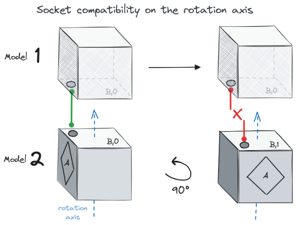

<div align="center">

# Ghx Proc(edural) Gen(eneration)

[](https://crates.io/crates/ghx_proc_gen)
[](https://docs.rs/ghx_proc_gen)

</div>

A Rust library for 2D & 3D procedural generation with **Model synthesis/Wave function Collapse**, also available for the [`Bevy`](https://github.com/bevyengine/bevy) engine.

<div align="center">


</div>

With Model synthesis/Wave function Collapse, **adjacency constraints** are provided as an input to the algorithm, and internally, a solver (AC-4 in this case), will try to generate a solution with satisfies those constraints.

Altough it can be applied to do texture synthesis (mainly with bitmaps), `ghx_proc_gen` focuses more on grid-based use-cases such as terrain or structures generation with the following goals of being:
- Fast. As much as possible, the core of the algorithm is implemented to be fast; if and when an API operation may hurt performances, this will be clearly visible.
- Output format agnostic. Models are just numbers in the core algorithm, and how you interpret them in the generator's results is up to you (3d objects, 2d sprites, texts, colors, ...).
- Ergonomic
- Well documented (`#![warn(missing_docs)]`)

# Quickstart

```
cargo add ghx_proc_gen
```

The building pieces of a generation are called `Models`, and adjacency constraints are defined with `Socket`. Every model has **one or more** socket on each of his sides.

Connections are defined between sockets, and allows models with connected sockets on opposite sides to be neighbours.

Let's build a chessboard pattern:

1) Start by creating `Rules` for the algorithm:
```rust
  // A SocketCollection is what we use to create sockets and define their connections
  let mut sockets = SocketCollection::new();
  // For this example, we will only need two sockets
  let (white, black) = (sockets.create(), sockets.create());

  // With the following, a `white` socket can connect to a `black` socket and vice-versa
  sockets.add_connection(white, vec![black]);

  let mut models = ModelCollection::<Cartesian2D>::new();
  // We define 2 very simple models: a white tile model with the `white` socket on each side
  // and a black tile model with the `black` socket on each side
  models.create(SocketsCartesian2D::Mono(white));
  // We keep the black model for later
  let black_model = models.create(SocketsCartesian2D::Mono(black)).clone();

  // We give the models and socket collection to a RulesBuilder and get our Rules
  let rules = RulesBuilder::new_cartesian_2d(models, sockets).build().unwrap();
```

2) Create a `GridDefinition`:
```rust
  // Like a chessboard, let's do an 8x8 2d grid
  let grid = GridDefinition::new_cartesian_2d(8, 8, false, false);
```

3) Create a `Generator` :
```rust
  // There many more parameters you can tweak on a Generator before building it, explore the API.
  let mut generator = GeneratorBuilder::new()
      .with_rules(rules)
      .with_grid(grid)
      // Let's ensure that we make a chessboard, with a black square bottom-left
      .with_initial_nodes(vec![(GridPosition::new_xy(0, 0), black_model)]).unwrap()
      .build()
      .unwrap();
```

4) Get a result:
```rust
  // Here we directly generate the whole grid, and ask for the result to be returned.
  // The generation could also be done iteratively via `generator.select_and_propagate()`, or the results could be obtained through an `Observer`
  let chess_pattern = generator.generate_collected().unwrap();
```

By simply printing the results in a terminal we obtain:
```rust
  let icons = vec!["◻️ ", "⬛"];
  for y in 0..chess_pattern.grid().size_y() {
      for x in 0..chess_pattern.grid().size_x() {
        print!("{}", icons[chess_pattern.get_2d(x, y).model_index]);
      }
      println!();
  }
```
<p align="center">
  
</p>

For more information, check out the main [crate documentation](https://docs.rs/ghx_proc_gen/latest/ghx_proc_gen) or all the [examples](#examples).

# More details on the API

### Model variations
---
To facilitate the rules-definition step, some models variations can be created for you automatically. This will take care of rotating all the model `sockets` properly.

Let's take this rope-bridge model as an example: 
<p align="center"></p>

```rust
  let bridge_model = SocketsCartesian3D::Simple {
    x_pos: bridge_side,
    x_neg: bridge_side,
    z_pos: bridge,
    z_neg: bridge,
    y_pos: bridge_top,
    y_neg: bridge_bottom,
  }
  .to_template()
  .with_additional_rotation(ModelRotation::Rot90)
```
With the above declaration, we declared our base model (with `Rot0` allowed by default), and allowed an extra rotation of `Rot90` degrees. Internally, when building the `Rules`, two models variations will be created.

When retrieving generated results, you get `ModelInstances` which reference the original model `index` as well as the `ModelRotation` applied to it.

You can also manually create rotated variations of a model: `bridge_model.rotated(ModelRotation::Rot180)` and use a different asset for it, change its weight, etc. [*[documentation](https://docs.rs/ghx_proc_gen/latest/ghx_proc_gen/generator/model/struct.Model.html)*].

### Coordinate systems & axis
---
`ghx_proc_gen` uses a **right-handed** coordinate system. But the rotation axis used to create model variations can vary:
- When using `Cartesian3D`, it defaults to `Y+` and can be customized on a `RulesBuilder`.
- When using `Cartesian2D`, the rotation axis is fixed to `Z+` [*[documentation](https://docs.rs/ghx_proc_gen/latest/ghx_proc_gen/generator/rules/struct.RulesBuilder.html)*].

*For Bevy, see the [Unofficial bevy Cheatbook](https://bevy-cheatbook.github.io/fundamentals/coords.html).*

### Socket connections
---
As seen in the quickstart, socket connections are declared with a `SocketCollection` [*[documentation](https://docs.rs/ghx_proc_gen/latest/ghx_proc_gen/generator/socket/struct.SocketCollection.html)*].

Note that sockets connections situated **on** your rotation axis should be handled differently if they are used on a model with generated rotations variations.

<p align="center"></p>

Rotating model **2** in the above figure causes its top socket (here `B`) to be different. For this example, we could use:
```rust
  // a socket `B` can only be connected to another `B` if their **relative** rotation is 0°
  sockets.add_constrained_rotated_connection(B, vec![ModelRotation::Rot0], vec![B]);
```
Let's imagine that models **1** and **2** had different sockets declarations on their top and bottom respectively, and that these sockets were only compatible when their relative rotation was 0° or 180°:
```rust
  // a socket `model_2_top` can only be connected to another `model_1_bottom`
  // if their **relative** rotation is 0° or 180°
  sockets.add_constrained_rotated_connection(
    model_2_top,
    vec![ModelRotation::Rot0, ModelRotation::Rot180],
    vec![model_1_bottom]
  );
```
See for axample the `bridge_start_bottom` socket in the canyon [example](#examples), which can only face outwards from a rock.

### Generator-human interaction
---
A generation can be customized by the user: by setting specific initial values via calls to `with_initial_nodes`/`with_initial_grid`, or by directly interacting with an on-going generation wia calls to `set_and_propagate`. [*[bevy plugin video example](https://github.com/Henauxg/ghx_proc_gen/blob/main/bevy_ghx_proc_gen/README.md#bevy-plugins)*].

_This is used by the `ProcGenDebugPlugin`._

### Observers
---
Instead of collecting the results of a Generator call direclty, you can retrieve them via an `Observer` connected to a Generator [*[documentation](https://docs.rs/ghx_proc_gen/latest/ghx_proc_gen/generator/observer/index.html)*].

_This is used by the `ProcGenDebugPlugin`._

### Grid loop
---
Grids can be configured to loop on any axis, this is set on their `GridDefinition` [*[documentation](https://docs.rs/ghx_proc_gen/latest/ghx_proc_gen/grid/struct.GridDefinition.html)*].

<div align="center">


</div>

# Cargo features

*Find the list and description in [ghx_proc_gen/cargo.toml](ghx_proc_gen/Cargo.toml)*

- `models-names` *[default]*: When creating models, you can register a name for them with the `with_name` function. With the feature disabled, the function does nothing. But when enabled, the name of your models will be accessible at runtime (and visible in the debug traces if enabled).
  
- `debug-traces`: Disabled by default, this feature will add traces (using the `tracing` crate) to the core algorithm of the crate. Since some of those logs are on the hot path, the feature should only be enabled in debug. 

  The log level can be configured by the user crates (`tracing::level`, the `LogPlugin` for Bevy, ...).
  
- `bevy`: Disabled by default, enabling it simply derives `Component` on common structs of the crate.
- `reflect`: Disabled by default, enabling it simply derives `Reflect` on common structs of the crate.

# For Bevy users

See the [`bevy_ghx_proc_gen`](bevy_ghx_proc_gen/README.md) crate which uses and exposes `ghx_proc_gen`, as well as additional plugins and utilities dedicated to Bevy.
```
cargo add bevy_ghx_proc_gen
```

# Examples
<div align="center">

|                   | Grid coordinate system | Assets            | Engine | Plugin              | Camera |
| ----------------- | ---------------------- | ----------------- | ------ | ------------------- | ------ |
| `Chessboard`      | Cartesian2D            | Unicode           | None   | N/A                 | N/A    |
| `Unicode terrain` | Cartesian2D            | Unicode           | None   | N/A                 | N/A    |
| `Bevy-chessboard` | Cartesian2D            | Procedural meshes | Bevy   | ProcGenSimplePlugin | 3D     |
| `Pillars`         | Cartesian3D            | .glb              | Bevy   | ProcGenDebugPlugin  | 3D     |
| `Tile-layers`     | Cartesian3D            | .png              | Bevy   | ProcGenDebugPlugin  | 2D     |
| `Canyon`          | Cartesian3D            | .glb              | Bevy   | ProcGenDebugPlugin  | 3D     |

*Examples videos for `unicode-terrain`, `pillars`, `tile-layers` & `canyon` are slowed down in order to see the generation progress*

</div>


<details>
  <summary>[Command-line] Chessboard example</summary>

```
cargo run --example chessboard
```
Simple standalone example, the same as in the [quickstart](#quickstart) section.

</details>

<details>
  <summary>[Command-line] Unicode terrain example</summary>

```
cargo run --example unicode-terrain
```

Simple standalone example which generates a top-down 2d terrain and displays it in the terminal with unicode characters.

https://github.com/Henauxg/ghx_proc_gen/assets/19689618/6a1108af-e078-4b27-bae1-65c793ef99c1

</details>

<details>
  <summary>[Bevy] Bevy chessboard example</summary>

```
cargo run --example bevy-chessboard
```

Simplest Bevy example, the same as in the [bevy quickstart](bevy_ghx_proc_gen/README.md#bevy-quickstart) section.

</details>

<details>
  <summary>[Bevy] Pillars example</summary>

```
cargo run --example pillars
```

This example generates multiple pillars of varying sizes in an empty room. Its `rules` are really simple with only 4 models: a void block, a pillar base, a pillar core and a pillar top.

https://github.com/Henauxg/ghx_proc_gen/assets/19689618/7beaa23c-df88-47ca-b1e6-8dcfc579ede2

</details>

<details>
  <summary>[Bevy] Tile-layers example</summary>

```
cargo run --example tile-layers
```

This example uses Bevy with a 2d Camera but generates a top-down tilemap by combining multiple z-layers, so the grid and rules used are still 3d.

https://github.com/Henauxg/ghx_proc_gen/assets/19689618/3efe7b78-3c13-4100-999d-af07c94f5a4d

</details>

<details>
  <summary>[Bevy] Canyon example</summary>

```
cargo run --example canyon
```

This example generates a canyon-like terrain with some animated windmills.

https://github.com/Henauxg/ghx_proc_gen/assets/19689618/25cbc758-3f1f-4e61-b6ed-bcf571e229af

</details>


# Misc

#### Rules-writing tips:
 - Start simple, then add complexity (new models, sockets and connections) iteratively. Adding one model can have a huge influence on the generation results, and may require weights tweaks.
 - Don't hesitate to define as many sockets as needed. Sockets onyl exist before the `Rules` are fully created, and are optimized away after.
 - Changing the Node selection heuristic may drastically change the generated results.
 - On rectangle grids, diagonals constraints are harder and need intermediary models.
 - There are often more than one way to achieve a particular result, and WFC/Model Synthesis shines when combined with other tools & effects. In particular you might find it useful to do some post-processing on the generated results (adding supports, combining models, ...).
  
#### Limitations:
- Generation size can quickly become an issue. For now, when the generator encounters an error (a contradiction between the rules and the state of a node), the generation restarts from the beginning. 
  
  There are some ways to lessen this problem, such as backtracking during the generation and/or modifying in parts. See [Model Synthesis and Modifying in Blocks](https://www.boristhebrave.com/2021/10/26/model-synthesis-and-modifying-in-blocks/) by BorisTheBrave or [Ph.D. Dissertation, University of North Carolina at Chapel Hill, 2009](https://paulmerrell.org/wp-content/uploads/2021/06/thesis.pdf) by P.Merell.

#### Why "ghx" ?
- It serves as a namespace to avoid picking cargo names such as `proc_gen` or `bevy_proc_gen`

# Credits

Thanks to:
- Paul Merrel for the [Model Synthesis](https://paulmerrell.org/model-synthesis/) algorithm & implementation
- Maxim Gumin for the [Wave Function Collapse](https://github.com/mxgmn/WaveFunctionCollapse) algorithm & implementation
- BorisTheBrave for his C# library [DeBroglie](https://github.com/BorisTheBrave/DeBroglie) and the article series on his [website](https://www.boristhebrave.com/)

# License

### Code

ghx-proc-gen is free and open source. All code in this repository is dual-licensed under either:

* MIT License ([LICENSE-MIT](LICENSE-MIT) or [http://opensource.org/licenses/MIT](http://opensource.org/licenses/MIT))
* Apache License, Version 2.0 ([LICENSE-APACHE](LICENSE-APACHE) or [http://www.apache.org/licenses/LICENSE-2.0](http://www.apache.org/licenses/LICENSE-2.0))

at your option.

Unless you explicitly state otherwise, any contribution intentionally submitted for inclusion in the work by you, as defined in the Apache-2.0 license, shall be dual licensed as above, without any additional terms or conditions.

### Assets

- Assets of the [`pillars`](bevy_examples/assets/pillars) and [`canyon`](bevy_examples/assets/canyon) examples were made for these examples by Gilles Henaux, and are availabe under [CC-BY-SA 4.0](https://creativecommons.org/licenses/by-sa/4.0/)
- Assets in the [`tile-layers`](bevy_examples/assets/tile_layers) example are "16x16 Game Assets" by George Bailey available on [OpenGameArt](https://opengameart.org/content/16x16-game-assets) under [CC-BY 4.0](https://creativecommons.org/licenses/by/4.0/)
