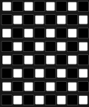

[](https://github.com/bevyengine/bevy/blob/main/docs/plugins_guidelines.md#main-branch-tracking)
[](https://crates.io/crates/ghx_proc_gen)
[](https://docs.rs/ghx_proc_gen)
[](https://crates.io/crates/bevy_ghx_proc_gen)
[](https://docs.rs/bevy_ghx_proc_gen)

# Ghx Proc(edural) Gen(eneration)

A Rust library for 2D & 3D procedural generation with **Model synthesis/Wave function Collapse**, also available for the Bevy engine.

With Model synthesis/Wave function Collapse, you provide **adjacency constraints** as an input to the algorithm, and internally, a solver (AC-4 in this case), will try to generate a solution with satisfies those constraints, very much like a sudoku solver.

Altough it can be applied to do texture synthesis (mainly with bitmaps), `ghx_proc_gen` focuses more on grid-based use-cases such as terrain or structures generation.

- [Ghx Proc(edural) Gen(eneration)](#ghx-procedural-geneneration)
  - [Quickstart](#quickstart)
  - [More information](#more-information)
  - [Cargo features](#cargo-features)
  - [For Bevy users](#for-bevy-users)
  - [Examples](#examples)
  - [Misc](#misc)
  - [Credits](#credits)
  - [License](#license)

https://github.com/Henauxg/ghx_proc_gen/assets/19689618/3f68c62e-ff0c-4d26-adf4-dbc25839dcf3

## Quickstart

```
cargo add ghx_proc_gen
```

In `ghx_proc_gen`, the building pieces of a generation are called `Models`, and adjacency constraints are defined with `Socket`. Every `Model` has **one or more** `Socket` on each of his sides.

Connections are then given between some of those `Sockets`, which allows `Models` with matching `Sockets` on opposite sides to be neighbours.

Let's build a checker board pattern:

1) Start by creating the `Rules` for the algorithm:
```rust
  // A SocketCollection is what we use to create sockets and define their connections
  let mut sockets = SocketCollection::new();
  // For this example, we will only need two sockets
  let (white, black) = (sockets.create(), sockets.create());

  // With the following, a `white` socket can connect to a `black` socket and vice-versa
  sockets.add_connection(white, vec![black]);

  // We define 2 very simple models: a white tile model with the `white` socket on each side
  // and a black tile model with the `black` socket on each side
  let models = vec![
      SocketsCartesian2D::Mono(white).new_model(),
      SocketsCartesian2D::Mono(black).new_model(),
  ];

  // We give the models and socket collection to a RulesBuilder and get our Rules
  let rules = RulesBuilder::new_cartesian_2d(models, sockets).build().unwrap();
```

2) Create a `GridDefinition`
```rust
  // Like a chess board, let's do an 8x8 2d grid
  let grid = GridDefinition::new_cartesian_2d(8, 8, false, false);
```

3) Create a `Generator` 
```rust
  // There many more parameters you can tweak on a Generator before building it, explore the API.
  let mut generator = GeneratorBuilder::new()
      .with_rules(rules)
      .with_grid(grid)
      .build();
```

4) Get a result
```rust
  // Here we directly generate the whole grid, and ask for the result to be returned.
  // The generation could also be done iteratively via `generator.select_and_propagate()`, or the results could be obtained through an `Observer`
  let checker_pattern = generator.generate_collected().unwrap();
```

If we simply print the result in the terminal we should obtain:
```rust
  let icons = vec!["◻️ ", "⬛"];
  for y in 0..checker_pattern.grid().size_y() {
      for x in 0..checker_pattern.grid().size_x() {
        print!("{}", icons[checker_pattern.get_2d(x, y).model_index]);
      }
      println!();
  }
```
<p align="center">
  
</p>

For more information, check out the [ghx_proc_gen crate documentation](https://docs.rs/ghx_proc_gen/latest/ghx_proc_gen) or all the [examples](#examples).

## More information

### Model variations

In order to facilitate the rules-definition step, `ghx_proc_gen` can create some models variations for you automatically. This will take care of rotating all the model `sockets` properly.

We will take this rope-bridge model as an example: 
<p align="center"></p>

```rust
  let bridge_model = SocketsCartesian3D::Simple {
    x_pos: bridge_side,
    x_neg: bridge_side,
    z_pos: bridge,
    z_neg: bridge,
    y_pos: bridge_top,
    y_neg: bridge_bottom,
  }
  .new_model()
  .with_additional_rotation(ModelRotation::Rot90)
```
With the above declaration, we declared our base model (with `Rot0` allowed by default), and allowed an extra rotation of `Rot90` degrees. Internally, when building the `Rules`, two models variations will be created.

When retrieving generated results, you get `ModelInstances` which reference the original model `index` as well as the `ModelRotation` applied to it.

You can also manually create rotated variations of a model: `bridge_model.rotated(ModelRotation::Rot180)` and use a different asset for it, change its weight, etc.

### Coordinate systems & axis

`ghx_proc_gen` uses a **right-handed** coordinate system. However, the rotation axis used to create model variations is up to you. When using `Cartesian3D`, it defaults to `Y+` and can be customized on the `Rules`. with `Cartesian2D`, it is fixed to `Z+`.

*For Bevy, see the [Unofficial bevy Cheatbook](https://bevy-cheatbook.github.io/fundamentals/coords.html).*

### Connections

As seen in the quickstart, socket connections are declared through a `SocketCollection`.

Do note that sockets connections situated on your rotation axis should be handled differently if they are to be used on a model that can have rotations variations.

<p align="center"></p>

Rotating Model 2 in the above figures causes its top socket(s) (here `B`) to be different(s). For this example, we could use:
```rust
  // a socket `B` can only be connected to another `B` if their **relative** rotation is 0°
  sockets.add_constrained_rotated_connection(B, vec![ModelRotation::Rot0], vec![B]);
```
Let's imagine that Model 1 and 2 had different sockets declarations on their top and bottom respectively, and that these sockets were only compatible when their relative rotation is 0° or 180°:
```rust
  // a socket `model_2_top` can only be connected to another `model_1_bottom`
  // if their **relative** rotation is 0° or 180°
  sockets.add_constrained_rotated_connection(
    model_2_top,
    vec![ModelRotation::Rot0, ModelRotation::Rot180],
    vec![model_1_bottom]
  );
```
See for axample the `bridge_start_bottom` socket in the canyon [example](#examples), which can only face outwards from a rock.

### Observers

Instead of collecting the results of a generator call direclty, you can retrieve them via an `Observer` connected to a `Generator`. This is what the `ProcGenDebugPlugin` does.

### Grid loop

Grids can be configured to loop on any axis, this is set from their `GridDefinition`.

https://github.com/Henauxg/ghx_proc_gen/assets/19689618/3cdab2d6-ef1a-4728-9685-7c2ef1688bff

## Cargo features

Find the list and description in [ghx_proc_gen/cargo.toml](ghx_proc_gen/Cargo.toml)

### `debug-traces`

Disabled by default, the `debug-traces` feature will add many debug traces (using the `tracing` crate) to the core algorithm of the crate. Since some of those logs are on the hot path, the feature should only be enabled in debug.

When creating models, you can register a name for them with the `with_name` function. With the feature disabled, the function does nothing. But when enabled, the name of your models will be visible in the debug traces of the core algorithm, providing useful information about the current generation state.

The log level can be configured by the user crates (`tracing::level`, the `LogPlugin` for Bevy, ...).


### `bevy`

Disabled by default, the `bevy` feature simply add some `Component` derive to common struct of `ghx_proc_gen`.

## For Bevy users

Instead of using the `ghx_proc_gen` crate directly, you can use the `bevy_ghx_proc_gen` crate which depends on and exports `ghx_proc_gen` (with the `bevy`feature enabled) as well as additional plugins & utilities dedicated to Bevy.
```
cargo add bevy_ghx_proc_gen
```

### Bevy quickstart

Steps `1` to `3` are the same as in the above [quickstart](#quickstart).
1) To automatically spawn our assets for us, we use the [ProcGenSimplePlugin](#bevy-plugins)
```rust
  app.add_plugins(ProcGenSimplePlugin::<Cartesian2D, PbrMesh>::new());
```
2) To see something in the Bevy viewport, we setup some assets:
```rust
fn setup_generator(
    mut commands: Commands,
    mut meshes: ResMut<Assets<Mesh>>,
    mut materials: ResMut<Assets<StandardMaterial>>,
) {
  // ... Steps 1 to 3: Generator setup ...

  // Simple procedural cube mesh and materials.
  let cube_mesh = meshes.add(Mesh::from(shape::Cube { size: CUBE_SIZE }));
  let white_mat = materials.add(Color::WHITE.into());
  let black_mat = materials.add(Color::BLACK.into());*
  // We create our models asset here, in a separate collection for the sake of simplicity.
  // (We could also declare them with our models)
  let mut models_assets = RulesModelsAssets::<PbrMesh>::new();
  models_assets.add_asset(0, PbrMesh {
          mesh: cube_mesh.clone(),
          material: white_mat,
      },
  );
  models_assets.add_asset(1, PbrMesh {
          mesh: cube_mesh.clone(),
          material: black_mat,
      },
  );

  // ...
}
```
3) Spawn an `Entity` with a `GeneratorBundle`
```rust
  // The ProcGenSimplePlugin will detect this, generate and spawn the nodes. 
  commands.spawn(GeneratorBundle {
      spatial: SpatialBundle::from_transform(Transform::from_translation(Vec3::new(
          -grid.size_x() as f32 / 2., -grid.size_y() as f32 / 2., 0.,
      ))),
      grid,
      generator,
      asset_spawner: AssetSpawner::new(models_assets, NODE_SIZE, Vec3::ONE),
  });
```
<p align="center">
  
</p>

For more information, check out the [bevy_ghx_proc_gen crate documentation](https://docs.rs/bevy_ghx_proc_gen/latest/bevy_ghx_proc_gen) or all the [examples](#examples).


### Bevy plugins

#### Grid plugin

`GridDebugPlugin` provides debug utilities for the grid-types bundlded within `ghx_proc_gen`:
  - Can draw a debug view of any 2d/3d grid
  - Can draw debug markers on any cells of a grid (controlled via bevy events)

Use it by inserting a `DebugGridView3d` bundle on your `Grid` entity (or `DebugGridView2d`, depending on your Bevy Camera).

<p align="center">
  
</p>

#### ProcGen plugins

`ghx_proc_gen` **does not need** a plugin to work, but if you want a really quick way to get started, or are in need of some debug utilities for your generations, there are some ready-made plugins for this:

- `ProcGenSimplePlugin`: Really simple, just here to generate and spawn the nodes assets. See [its sources](bevy_ghx_proc_gen/src/gen/simple_plugin.rs).

- `ProcGenDebugPlugin` [*Depends on `GridDebugPlugin`*]: Just a bit more complex, and not focused on performance but rather on demos & debugging use-cases. You can view the generation one step at a time, see where the contradiction occurs and more. See [its sources](bevy_ghx_proc_gen/src/gen/debug_plugin.rs).

Both of those `plugins` start their work when you insert the components from a `GeneratorBundle` on an `Entity`.

### Cargo features of `bevy_ghx_proc_gen`

Find the list and description in [bevy_ghx_proc_gen/Cargo.toml](bevy_ghx_proc_gen/Cargo.toml)

- `default-assets-bundle-spawners`: This feature enables some simple `AssetBundleSpawner` `impl` for basic types: (`Handle<Image>`, `Handle<Scene>`, `MaterialMesh` and `PbrMesh`). Disable the feature if you don't need them, or want to customize their implementation.
- `grid-debug-plugin` compiles the grid debug plugin and its systems.
- `simple-plugin` compiles the simple plugin and its systems.
- `debug-plugin` compiles the debug plugin and its systems.

### Compatible Bevy versions

Compatibility with Bevy versions:

| `bevy_ghx_proc_gen` | `bevy` |
| :------------------ | :----- |
| `0.1`               | `0.12` |

## Examples


|                        | Checkerboard | Unicode terrain | Bevy-checkerboard | Pillars     | Tile-layers | Canyon      |
| ---------------------- | ------------ | --------------- | ----------------- | ----------- | ----------- | ----------- |
| Grid coordinate system | Cartesian2D  | Cartesian2D     | Cartesian2D       | Cartesian3D | Cartesian3D | Cartesian3D |
| Assets                 | Unicode      | Unicode         | Procedural meshes | .glb        | .png        | .glb        |
| Engine                 | None         | None            | Bevy              | Bevy        | Bevy        | Bevy        |
| Camera                 | N/A          | N/A             | 3D                | 3D          | 2D          | 3D          |

*Examples videos for `unicode-terrain`, `pillars`, `tile-layers` & `canyon` are slowed down (with the `ProcGenDebugPlugin` for Bevy) in order to see the generation happen*

<details>
  <summary>[Command-line] Checkerboard example</summary>

```
cargo run --example checkerboard
```
Simple standalone example, the same as in the [quickstart](#quickstart) section.

</details>

<details>
  <summary>[Command-line] Unicode terrain example</summary>

```
cargo run --example unicode-terrain
```

Simple standalone example which generates a top-down 2d terrain and displays it in the terminal with unicode characters.

https://github.com/Henauxg/ghx_proc_gen/assets/19689618/6a1108af-e078-4b27-bae1-65c793ef99c1

</details>

<details>
  <summary>[Bevy + ProcGenSimplePlugin] Bevy checkerboard example</summary>

```
cargo run --example bevy-checkerboard
```

Simplest Bevy example, the same as in the [bevy quickstart](#bevy-quickstart) section.

</details>

<details>
  <summary>[Bevy + ProcGenDebugPlugin] Pillars example</summary>

```
cargo run --example pillars
```

This example generates multiple pillars of varying sizes in an empty room. Its `rules` are really simple with only 4 models: a void block, a pillar base, a pillar core and a pillar top.

https://github.com/Henauxg/ghx_proc_gen/assets/19689618/7beaa23c-df88-47ca-b1e6-8dcfc579ede2

*See the [keybindings](#keybindings)*

</details>

<details>
  <summary>[Bevy + ProcGenDebugPlugin] Tile-layers example</summary>

```
cargo run --example tile-layers
```

This example uses Bevy with a 2d Camera but generates a top-down tilemap by combining multiple z-layers, so the grid and rules used are still 3d.

https://github.com/Henauxg/ghx_proc_gen/assets/19689618/3efe7b78-3c13-4100-999d-af07c94f5a4d

*See the [keybindings](#keybindings)*

</details>

<details>
  <summary>[Bevy + ProcGenDebugPlugin] Canyon example</summary>

```
cargo run --example canyon
```

This example generates a canyon-like terrain with some animated windmills.

https://github.com/Henauxg/ghx_proc_gen/assets/19689618/25cbc758-3f1f-4e61-b6ed-bcf571e229af

*See the [keybindings](#keybindings)*

</details>

#### Keybindings 

Keybindings for the `Pillars`, `Tile-layers` and `Canyon` examples: 
- `F1`: toggles the debug grid view
- `F2`: toggles the FPS display
- `Space` unpauses the current generation
- `Right` used only with `GenerationViewMode::StepByStepPaused` to step once per press
- `Up` used only with `GenerationViewMode::StepByStepPaused` to step continuously as long as pressed

## Misc

Rules-writing tips:
 - Start simple, then add complexity (new models, sockets and connections) iteratively. Adding one model can have a huge influence on the generation results, and may require weights tweaks.
 - Changing the Node selection heuristic may drastically change the generated results.
 - On rectangle grids, diagonals constraints are harder and need intermediary models.
 - There are often more than one way to achieve a particular result, and WFC/Model Synthesis shines when combined with other tools & effects. In particular you might find it useful to do some post-processing on the generated results (adding supports, combining models, ...).
  
Limitations:
- Generation size can quickly become an issue. For now, when the generator encounters an error (a contradiction between the rules and the state of a node), the generation restarts from the beginning. There are some ways to lessen this problem, such as backtracking during the generation and/or modifying in parts (see [Model Synthesis and Modifying in Blocks](https://www.boristhebrave.com/2021/10/26/model-synthesis-and-modifying-in-blocks/) by BorisTheBrave or [Ph.D. Dissertation, University of North Carolina at Chapel Hill, 2009](https://paulmerrell.org/wp-content/uploads/2021/06/thesis.pdf) by P.Merell).

Why "ghx" ?
- It serves as a namespace to avoid picking cargo names such as `proc_gen` or `bevy_proc_gen`

## Credits

Thanks to:
- Paul Merrel for the [Model Synthesis](https://paulmerrell.org/model-synthesis/) algorithm & implementation
- Maxim Gumin for the [Wave Function Collapse](https://github.com/mxgmn/WaveFunctionCollapse) algorithm & implementation
- BorisTheBrave for his C# library [DeBroglie](https://github.com/BorisTheBrave/DeBroglie) and the article series on his [website](https://www.boristhebrave.com/)

## License

### Code

ghx-proc-gen is free and open source. All code in this repository is dual-licensed under either:

* MIT License ([LICENSE-MIT](LICENSE-MIT) or [http://opensource.org/licenses/MIT](http://opensource.org/licenses/MIT))
* Apache License, Version 2.0 ([LICENSE-APACHE](LICENSE-APACHE) or [http://www.apache.org/licenses/LICENSE-2.0](http://www.apache.org/licenses/LICENSE-2.0))

at your option.

Unless you explicitly state otherwise, any contribution intentionally submitted for inclusion in the work by you, as defined in the Apache-2.0 license, shall be dual licensed as above, without any additional terms or conditions.

### Assets

- Assets of the [`pillars`](bevy_examples/assets/pillars) and [`canyon`](bevy_examples/assets/canyon) examples were made for these examples by Gilles Henaux, and are availabe under [CC-BY-SA 4.0](https://creativecommons.org/licenses/by-sa/4.0/)
- Assets in the [`tile-layers`](bevy_examples/assets/tile_layers) example are "16x16 Game Assets" by George Bailey available on [OpenGameArt](https://opengameart.org/content/16x16-game-assets) under [CC-BY 4.0](https://creativecommons.org/licenses/by/4.0/)
