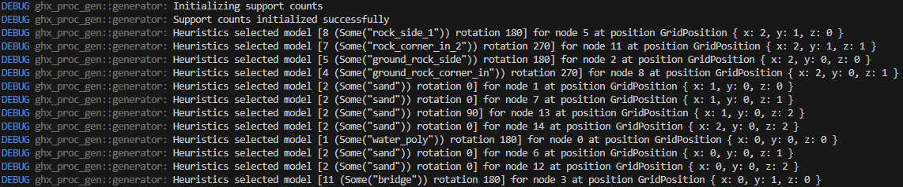

[](https://github.com/bevyengine/bevy/blob/main/docs/plugins_guidelines.md#main-branch-tracking)
[](https://crates.io/crates/ghx_proc_gen)
[](https://crates.io/crates/bevy_ghx_proc_gen)

# Ghx Proc(edural) Gen(eneration)

A Rust library for 2D & 3D procedural generation with *Model synthesis/Wave function Collapse*, also available for the Bevy engine.

With *Model synthesis/Wave function Collapse*, you provide adjacency **constraints** as an input to the algorithm, and internally, a solver (AC-4 in this case), will try to generate a solution with satisfies those constraints, very much like a sudoku solver.

Altough it can be applied to do texture synthesis (mainly with bitmaps), `ghx_proc_gen` focuses more on grid-based use-cases such as terrain/structures/...

- [Ghx Proc(edural) Gen(eneration)](#ghx-procedural-geneneration)
  - [Quickstart](#quickstart)
  - [Additional information for Bevy users](#additional-information-for-bevy-users)
    - [Bevy plugins](#bevy-plugins)
    - [Compatible Bevy versions](#compatible-bevy-versions)
  - [Examples](#examples)
  - [Features](#features)
    - [`debug-traces`](#debug-traces)
  - [Misc](#misc)
  - [Credits](#credits)
  - [License](#license)
    - [Code](#code)
    - [Assets](#assets)

## Quickstart

```
cargo add ghx_proc_gen
```

In `ghx_proc_gen`, the building pieces of a generation are called `Models`, and adjacency constraints are defined with `Socket`. Every `Model` has one or more `Socket` on each of his sides.

Connections are then given between some of those `Sockets`, which allows `Models` with matching `Sockets` on opposite sides to be neighbours.

Let's build a checker board pattern:

1) Start by creating the `Rules` for the algorithm:
```rust
  // A SocketCollection is what we use to create sockets and define their connections
  let mut sockets = SocketCollection::new();
  // For this example, we will only need two sockets
  let (white, black) = (sockets.create(), sockets.create());

  // With the following, a `white` socket can connect to a `black` socket and vice-versa
  sockets.add_connection(white, vec![black]);

  // We define 2 very simple models: a white tile model with the `white` socket on each side
  // and a black tile model with the `black` socket on each side
  let models = vec![
      SocketsCartesian2D::Mono(white).new_model(),
      SocketsCartesian2D::Mono(black).new_model(),
  ];

  // We give the models and socket collection to a RulesBuilder and get our Rules
  let rules = RulesBuilder::new_cartesian_2d(models, sockets).build().unwrap();
```

2) Create a `GridDefinition`
```rust
  // Like a chess board, let's do an 8x8 2d grid
  let grid = GridDefinition::new_cartesian_2d(8, 8, false, false);
```

3) Create a `Generator` 
```rust
  // There many more parameters you can tweak on a Generator before building it, explore the API.
  let mut generator = GeneratorBuilder::new()
      .with_rules(rules)
      .with_grid(grid)
      .build();
```

4) Get a result
```rust
  // Here we directly generate the whole grid, and ask for the result to be returned.
  // The generation could also be done iteratively via `generator.select_and_propagate()`, or the results could be obtained through an `Observer`
  let checker_pattern = generator.generate_collected().unwrap();
```

If we simply print the result in the terminal we should obtain:
```rust
  let icons = vec!["◻️ ", "⬛"];
  for y in 0..checker_pattern.grid().size_y() {
      for x in 0..checker_pattern.grid().size_x() {
        print!("{}", icons[checker_pattern.get_2d(x, y).model_index]);
      }
      println!();
  }
```
<p align="center">
  
</p>

For more information, check out the [crate documentation](https://docs.rs/ghx_proc_gen/latest/ghx_proc_gen) or the [examples](#examples).

## Additional information for Bevy users

Instead of using the `ghx_proc_gen` crate directly, you can use the `bevy_ghx_proc_gen` crate which exports `ghx_proc_gen` as well as additional plugins & utilities dedicated to Bevy.
```
cargo add bevy_ghx_proc_gen
```

### Bevy plugins

- `GridDebugPlugin`
- `ProcGenExamplesPlugin`

### Compatible Bevy versions

Compatibility with Bevy versions:

| `bevy_ghx_proc_gen` | `bevy` |
| :------------------ | :----- |
| `0.1`               | `0.12` |

## Examples

<details>
  <summary>[Command-line] Checkerboard example</summary>

```
cargo run --example checkerboard
```

</details>

<details>
  <summary>[Command-line] Unicode terrain example</summary>

```
cargo run --example unicode-terrain
```

</details>

<details>
  <summary>[Bevy + ProcGenSimplePlugin] Bevy checkerboard example</summary>

```
cargo run --example bevy-checkerboard
```

</details>

<details>
  <summary>[Bevy + ProcGenDebugPlugin] Pillars example</summary>

```
cargo run --example pillars
```

</details>


<details>
  <summary>[Bevy + ProcGenDebugPlugin] Tile-layers example</summary>

```
cargo run --example tile-layers
```

</details>

<details>
  <summary>[Bevy + ProcGenDebugPlugin] Canyon example</summary>

```
cargo run --example canyon
```

</details>

## Features

### `debug-traces`

Disabled by default, this feature will add many debug traces (using the `tracing` crate) to the core algorithm of the crate. Since some of those logs are on the hot path, the feature should only be enabled in debug.

When creating models, you can register a name for them with the `with_name` function. With the feature disabled, the function does nothing. But when enabled, the name of your models will be visible in the debug traces of the core algorithm, providing useful information about the current generation state.

The log level can be configured by the user crates (`tracing::level`, the `LogPlugin` for Bevy, ...).



## Misc

Rules-writing tips:
 - Start simple, then add complexity iteratively
 - Changing the Node selection heuristic may drastically change the generated results
 - On rectangle grids, diagonals constraints are harder and need intermediary models

Why "ghx" ?
- It serves as a namespace to avoid picking cargo names such as `proc_gen` or `bevy_proc_gen`

## Credits

Thanks to:
- Paul Merrel for the [Model Synthesis](https://paulmerrell.org/model-synthesis/) algorithm & implementation
- Maxim Gumin for the [Wave Function Collapse](https://github.com/mxgmn/WaveFunctionCollapse) algorithm & implementation
- BorisTheBrave for his C# library [DeBroglie](https://github.com/BorisTheBrave/DeBroglie) and the article series on his [website](https://www.boristhebrave.com/)

## License

### Code

ghx-proc-gen is free and open source. All code in this repository is dual-licensed under either:

* MIT License ([LICENSE-MIT](LICENSE-MIT) or [http://opensource.org/licenses/MIT](http://opensource.org/licenses/MIT))
* Apache License, Version 2.0 ([LICENSE-APACHE](LICENSE-APACHE) or [http://www.apache.org/licenses/LICENSE-2.0](http://www.apache.org/licenses/LICENSE-2.0))

at your option.

Unless you explicitly state otherwise, any contribution intentionally submitted for inclusion in the work by you, as defined in the Apache-2.0 license, shall be dual licensed as above, without any additional terms or conditions.

### Assets

- Assets of the [`pillars`](bevy_examples/assets/pillars) and [`canyon`](bevy_examples/assets/canyon) examples were made for these examples by Gilles Henaux, and are availabe under [CC-BY-SA 4.0](https://creativecommons.org/licenses/by-sa/4.0/)
- Assets in the [`tile-layers`](bevy_examples/assets/tile_layers) example are "16x16 Game Assets" by George Bailey available on [OpenGameArt](https://opengameart.org/content/16x16-game-assets) under [CC-BY 4.0](https://creativecommons.org/licenses/by/4.0/)