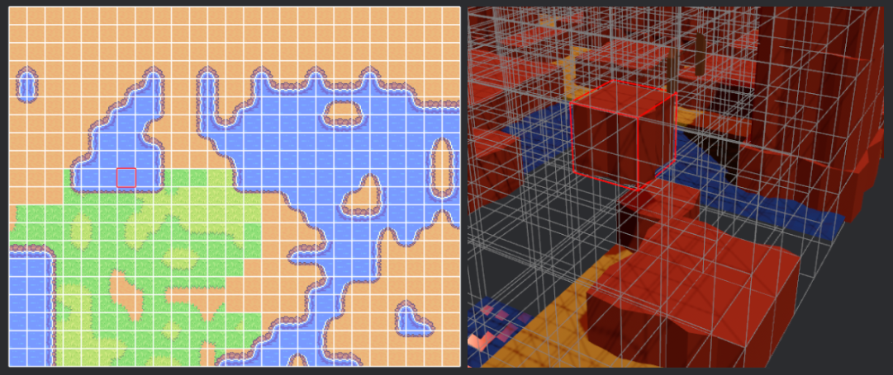

<div align="center">

# Bevy Ghx Proc(edural) Gen(eneration)

[](https://github.com/bevyengine/bevy/blob/main/docs/plugins_guidelines.md#main-branch-tracking)
[](https://crates.io/crates/bevy_ghx_proc_gen)
[](https://docs.rs/bevy_ghx_proc_gen)


[`Bevy`](https://github.com/bevyengine/bevy) plugins and utilities for [`ghx_proc_gen`](../README.md)

</div>

# Bevy quickstart

```
cargo add bevy_ghx_proc_gen
```

Steps `1` to `3` are the same as in the `ghx_proc_gen`  [Quickstart](../README.md#quickstart).
1) To automatically spawn our assets for us, we use the `ProcGenSimplePlugin`
```rust
  app.add_plugins(ProcGenSimplePlugin::<Cartesian2D, PbrMesh>::new());
```
1) To see something in the Bevy viewport, we setup assets in a `RulesModelsAssets`:
```rust
fn setup_generator(
    mut commands: Commands,
    mut meshes: ResMut<Assets<Mesh>>,
    mut materials: ResMut<Assets<StandardMaterial>>,
) {
  // ... Steps 1 to 3: Generator setup ...

  // Simple procedural cube mesh and materials.
  let cube_mesh = meshes.add(Mesh::from(shape::Cube { size: CUBE_SIZE }));
  let white_mat = materials.add(Color::WHITE.into());
  let black_mat = materials.add(Color::BLACK.into());*
  // We create our models asset here, in a separate collection for the sake of simplicity.
  // (We could also declare them with our models)
  let mut models_assets = RulesModelsAssets::<PbrMesh>::new();
  models_assets.add_asset(0, PbrMesh {
          mesh: cube_mesh.clone(),
          material: white_mat,
      },
  );
  models_assets.add_asset(1, PbrMesh {
          mesh: cube_mesh.clone(),
          material: black_mat,
      },
  );

  // ...
}
```
3) Spawn an `Entity` with a `GeneratorBundle`:
```rust
  // The ProcGenSimplePlugin will detect this, generate and spawn the nodes. 
  commands.spawn(GeneratorBundle {
      spatial: SpatialBundle::from_transform(Transform::from_translation(Vec3::new(
          -grid.size_x() as f32 / 2., -grid.size_y() as f32 / 2., 0.,
      ))),
      grid,
      generator,
      asset_spawner: AssetSpawner::new(models_assets, NODE_SIZE, Vec3::ONE),
  });
```
<p align="center">
  
</p>

For more information, check out the `bevy_ghx_proc_gen` [crate documentation](https://docs.rs/bevy_ghx_proc_gen/latest/bevy_ghx_proc_gen) or the [Examples](../README.md#examples).


# Bevy plugins

## Grid plugin

`GridDebugPlugin` provides debug utilities for the grid-types bundlded within `ghx_proc_gen`:
  - Can draw a debug view of any 2d/3d grid
  - Can draw debug markers on any cells of a grid (controlled via bevy events)

Use it by inserting a `DebugGridView3d` bundle on your `Grid` entity (or `DebugGridView2d`, depending on your Bevy Camera).

<p align="center">
  
</p>

## ProcGen plugins

`ghx_proc_gen` **does not need** a plugin to work, but if you want a really quick way to get started, or are in need of some debug utilities for your generations, there are some ready-made plugins for this:

- `ProcGenSimplePlugin`: Really simple, just here to generate and spawn the nodes assets. See [its sources](src/gen/simple_plugin.rs).

- `ProcGenDebugPlugin` [*Depends on `GridDebugPlugin`*]: Just a bit more complex, and not focused on performance but rather on demos & debugging use-cases. You can view the generation one step at a time, see where the contradiction occurs and more. See [its sources](src/gen/debug_plugin.rs).

Both of those `plugins` start their work when you insert the components from a `GeneratorBundle` on an `Entity`.

# Cargo features

*Find the list and description in [Cargo.toml](Cargo.toml)*

- `default-assets-bundle-spawners`: This feature compiles simple `AssetBundleSpawner impl` for a few basic types. Disable the feature if you don't need them, or want to customize their implementation.
- `grid-debug-plugin` compiles the grid debug plugin and its systems.
- `simple-plugin` compiles the simple plugin and its systems.
- `debug-plugin` compiles the debug plugin and its systems.

*See also the [main crate](../README.md#cargo-features) cargo features*

# Compatible Bevy versions

Compatibility with Bevy versions:

| `bevy_ghx_proc_gen` | `bevy` |
| :------------------ | :----- |
| `0.1`               | `0.12` |

# License

bevy-ghx-proc-gen is free and open source. All code in this repository is dual-licensed under either:

* MIT License ([LICENSE-MIT](../LICENSE-MIT) or [http://opensource.org/licenses/MIT](http://opensource.org/licenses/MIT))
* Apache License, Version 2.0 ([LICENSE-APACHE](../LICENSE-APACHE) or [http://www.apache.org/licenses/LICENSE-2.0](http://www.apache.org/licenses/LICENSE-2.0))

at your option.

Unless you explicitly state otherwise, any contribution intentionally submitted for inclusion in the work by you, as defined in the Apache-2.0 license, shall be dual licensed as above, without any additional terms or conditions.