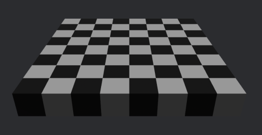

<div align="center">

# Bevy Ghx Proc(edural) Gen(eneration)

[](https://github.com/bevyengine/bevy/blob/main/docs/plugins_guidelines.md#main-branch-tracking)
[](https://crates.io/crates/bevy_ghx_proc_gen)
[](https://docs.rs/bevy_ghx_proc_gen)


[`Bevy`](https://github.com/bevyengine/bevy) plugins and utilities for [`ghx_proc_gen`](../README.md)

</div>

# Bevy quickstart

```
cargo add bevy_ghx_proc_gen
```

Steps `1` to `3` are the same as in the `ghx_proc_gen`  [Quickstart](../README.md#quickstart).
1) To automatically spawn our assets for us, we use the provided plugins
```rust
    app.add_plugins(ProcGenSimplePlugins::<Cartesian2D, PbrMesh>::default());
```
1) To see something in the Bevy viewport, we setup assets in a `ModelsAssets`:
```rust
fn setup_generator(
    mut commands: Commands,
    mut meshes: ResMut<Assets<Mesh>>,
    mut materials: ResMut<Assets<StandardMaterial>>,
) {
  // ... Steps 1 to 3: Generator setup ...

  // Simple procedural cube mesh and materials.
  let cube_mesh = meshes.add(Mesh::from(Cuboid {
      half_size: Vec3::splat(CUBE_SIZE / 2.),
  }));
  let white_mat = materials.add(Color::WHITE);
  let black_mat = materials.add(Color::BLACK);
  // We create our models asset here, in a separate collection for the sake of simplicity.
  // (We could also declare them with our models)
  let mut models_assets = ModelsAssets::<PbrMesh>::new();
  models_assets.add_asset(0, PbrMesh {
          mesh: cube_mesh.clone(),
          material: white_mat,
      },
  );
  models_assets.add_asset(1, PbrMesh {
          mesh: cube_mesh.clone(),
          material: black_mat,
      },
  );

  // ...
}
```
3) Spawn an `Entity` with a `GeneratorBundle`:
```rust
  // The plugins will detect this, run the generator and spawn the nodes. 
  commands.spawn(GeneratorBundle {
      Transform::from_translation(Vec3::new(-4., -4., 0.)),
      grid,
      generator,
      NodesSpawner::new(models_assets, NODE_SIZE, Vec3::ONE),
  });
```
<p align="center">
  
</p>

- For more information, check out the `bevy_ghx_proc_gen` [crate documentation](https://docs.rs/bevy_ghx_proc_gen/latest/bevy_ghx_proc_gen) or the [Examples](../README.md#examples).
- Almost all systems, structs components, resources, ... have a `pub` visibility, so you can use or override them in custom plugins

# Bevy plugins

- Check out the `GridDebugPlugin` from [`bevy_ghx_grid`](https://github.com/Henauxg/bevy_ghx_grid) which provides debug utilities for the grid-types used by `ghx_proc_gen`.

`ghx_proc_gen` **does not need** a plugin to work, but if you want a really quick way to get started, or are in need of some debug utilities for your generations, there are some ready-made plugins for this:

- `ProcGenSimplePlugin`: Really simple, just here to generate and spawn the nodes assets. See [its sources](src/gen/simple_plugin.rs).

- `ProcGenDebugPlugin` [*Depends on `GridDebugPlugin`*]: Just a bit more complex, and not focused on performance but rather on demos & debugging use-cases. You can view the generation one step at a time, see where the contradiction occurs and more. See [its sources](src/gen/debug_plugin.rs).
  - Keybindings as well as most settings used by the debug plugin can be overriden via some Bevy `Resource`.
  - Note that the debug plugin, with all features enabled, depends on other plugins to function propely, such as: `DefaultPickingPlugins` (from bevy_mod_picking), `EguiPlugin` (from bevy_egui) or the `GridDebugPlugin` (from bevy_ghx_grid)

Both of those `plugins` start their work when you insert the components from a `GeneratorBundle` on an `Entity`.

<div align="center">
  
`ProcGenDebugPlugin` editing feature demo:
  
https://github.com/Henauxg/ghx_proc_gen/assets/19689618/b2f15673-e6aa-4a1d-94f7-a98c903a7591

https://github.com/Henauxg/ghx_proc_gen/assets/19689618/5fa26a8f-7454-4574-9cc3-f6f77fdd0049

</div>

# Cargo features

*Find the list and description in [Cargo.toml](Cargo.toml)*

- `default-bundle-inserters `: This feature compiles simple `BundleInserter impl` for a few basic types. Disable the feature if you don't need them, or want to customize their implementation.
- `reflect`: simply derives `Reflect` on common structs of the crate.
- `simple-plugin`: compiles the simple plugin and its systems.
- `debug-plugin`: compiles the debug plugin, the grid debug plugin and their systems.
- `picking`: Enables picking. Used by the debug-plugin if enabled.
- `egui-edit`: Enables an `egui` editor panel to inspect nodes and paint models

*See also the [main crate](../README.md#cargo-features) cargo features*

# Compatible Bevy versions

Compatibility with Bevy versions:

| ghx_proc_gen | bevy_ghx_proc_gen | bevy |
| :----------- | :---------------- | :--- |
| 0.8          | 0.8               | 0.18 |
| 0.7          | 0.7               | 0.17 |
| 0.6          | 0.6               | 0.16 |
| 0.5          | 0.5               | 0.15 |
| 0.4          | 0.4               | 0.14 |
| 0.2-0.3      | 0.2-0.3           | 0.13 |
| 0.1          | 0.1               | 0.12 |

# License

bevy-ghx-proc-gen is free and open source. All code in this repository is dual-licensed under either:

* MIT License ([LICENSE-MIT](../LICENSE-MIT) or [http://opensource.org/licenses/MIT](http://opensource.org/licenses/MIT))
* Apache License, Version 2.0 ([LICENSE-APACHE](../LICENSE-APACHE) or [http://www.apache.org/licenses/LICENSE-2.0](http://www.apache.org/licenses/LICENSE-2.0))

at your option.

Unless you explicitly state otherwise, any contribution intentionally submitted for inclusion in the work by you, as defined in the Apache-2.0 license, shall be dual licensed as above, without any additional terms or conditions.
